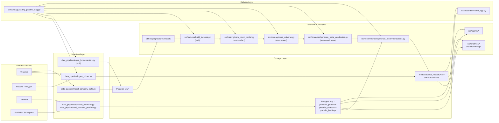
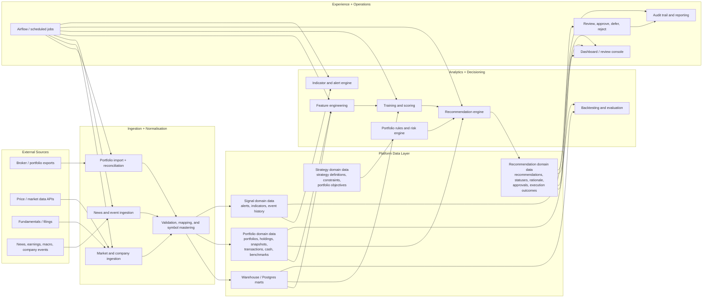

# Trading Platform

This repository contains a personal trading platform focused on:

- managing existing portfolios and their snapshots
- generating and tracking portfolio recommendations
- monitoring market, company, and eventually news-driven indicators that affect those portfolios
- using stock and market calendar data such as earnings, dividends, splits, and economic events as monitoring inputs
- introducing scheduling and automation later, once the core concept and foundations are proven

The codebase already has the skeleton of that platform in place: Postgres-backed portfolio storage, price and company ingestion, dbt models, a batch recommendation flow, a Streamlit dashboard, and Airflow orchestration scaffolding. Some parts are production-shaped, and some parts are still placeholders.

## Recent Evolution

Recent iterations have moved the repository from a static portfolio viewer toward a more useful monitoring surface:

- The dashboard now shows snapshot-aware holding movement beside the latest price, using up, down, and unchanged indicators based on the previous portfolio snapshot.
- Holding detail pages now expose stored daily news sentiment summaries and article-level drilldowns for a selected symbol.
- The agent layer now includes holding news sentiment support and a runnable entrypoint for news-driven portfolio review workflows.
- The platform still relies on batch refresh patterns, but the UI now does a better job of surfacing what changed between snapshots instead of only showing the latest state.

## Platform Goal

The target platform is not just a stock screener. It should support four connected jobs:

1. maintain a trusted view of current portfolios, positions, weights, and snapshot history
2. produce explainable strategy and recommendation outputs for those portfolios
3. watch market data, fundamentals, news/events, and stock or market calendar events for indicators that should trigger review, alerts, or portfolio actions
4. add scheduling and automation for refresh, monitoring, reporting, and recurring review workflows once the platform foundations are stable

## Current Architecture

The current implementation is best described as a batch analytics and recommendation scaffold around portfolio snapshots.



## What Exists Today

### Portfolio management

- Personal portfolios, snapshots, and holdings are stored in Postgres via [`data_pipeline/personal_portfolios.py`](/Users/ruaan.venter/code/trading-platform/data_pipeline/personal_portfolios.py).
- The platform supports importing holdings from CSV exports and preserving snapshot history instead of overwriting the latest state.
- There is a seeded SIPP workflow with price refresh and symbol resolution in [`data_pipeline/load_personal_portfolio.py`](/Users/ruaan.venter/code/trading-platform/data_pipeline/load_personal_portfolio.py).
- The dashboard can display portfolios, snapshots, and holdings from Postgres in [`dashboard/streamlit_app.py`](/Users/ruaan.venter/code/trading-platform/dashboard/streamlit_app.py).
- Holdings in the dashboard now show movement against the previous snapshot directly next to the current `price`, making day-over-day portfolio changes easier to scan.

### Market and company data

- Latest company-level yfinance datasets can be ingested into Postgres raw tables by [`data_pipeline/ingest_company_data.py`](/Users/ruaan.venter/code/trading-platform/data_pipeline/ingest_company_data.py).
- Latest price lookup is available through yfinance and Massive in [`data_pipeline/ingest_prices.py`](/Users/ruaan.venter/code/trading-platform/data_pipeline/ingest_prices.py) and [`data_pipeline/price_providers.py`](/Users/ruaan.venter/code/trading-platform/data_pipeline/price_providers.py).
- Historical price loading for holdings and benchmarks exists in [`src/backtesting/load_price_history.py`](/Users/ruaan.venter/code/trading-platform/src/backtesting/load_price_history.py).

### Recommendation and analysis flow

- Recommendation generation is implemented in [`src/recommender/generate_recommendations.py`](/Users/ruaan.venter/code/trading-platform/src/recommender/generate_recommendations.py).
- A baseline portfolio review agent exists in [`src/agents/market_analysis.py`](/Users/ruaan.venter/code/trading-platform/src/agents/market_analysis.py).
- Holding news sentiment loading, summarisation, and agent entrypoints now exist in [`data_pipeline/holding_news.py`](/Users/ruaan.venter/code/trading-platform/data_pipeline/holding_news.py), [`src/agents/holding_news_sentiment.py`](/Users/ruaan.venter/code/trading-platform/src/agents/holding_news_sentiment.py), and [`src/agents/run_holding_news_agent.py`](/Users/ruaan.venter/code/trading-platform/src/agents/run_holding_news_agent.py).
- Holdings analytics and recommender backtesting exist in [`src/analytics/evaluate_holdings_history.py`](/Users/ruaan.venter/code/trading-platform/src/analytics/evaluate_holdings_history.py) and [`src/backtesting/backtest_recommender.py`](/Users/ruaan.venter/code/trading-platform/src/backtesting/backtest_recommender.py).

### Orchestration and transformation

- dbt staging and feature models exist under [`dbt/models`](/Users/ruaan.venter/code/trading-platform/dbt/models).
- A weekday Airflow DAG scaffolds the end-to-end batch sequence in [`airflow/dags/trading_pipeline_dag.py`](/Users/ruaan.venter/code/trading-platform/airflow/dags/trading_pipeline_dag.py).
- The main local workflow is exposed through the [`Makefile`](/Users/ruaan.venter/code/trading-platform/Makefile).

## Important Current Limitations

These limitations should be explicit because they shape the real current architecture:

- `build_features`, `train_return_model`, `score_universe`, and part of the strategy flow are still stub implementations that write placeholder artifacts rather than warehouse-backed model outputs.
- Fundamentals ingestion is still a stub outside the yfinance company-data ingestion path.
- Recommendations are written to CSV artifacts, not yet persisted as first-class database entities with lifecycle state.
- News sentiment display and agent hooks now exist, but there is still no full news ingestion, event detection, alerting, or watchlist-monitoring pipeline yet.
- There is no implemented stock-calendar or market-calendar ingestion pipeline yet.
- The dashboard now includes holding-level movement and news context, but it is still a monitoring viewer rather than a full decision workflow UI.

## To-Be Architecture

The target architecture should promote portfolios and monitoring to first-class concerns, with recommendations and signals persisted in the platform rather than only emitted as files.



## What Still Needs To Be Done

The list below is based on the current repository state and the stated platform goal.

### Foundation work

- Implement real feature engineering in [`src/features/build_features.py`](/Users/ruaan.venter/code/trading-platform/src/features/build_features.py) from warehouse and portfolio data instead of the current stub.
- Replace the placeholder model training and scoring flow in [`src/training/train_return_model.py`](/Users/ruaan.venter/code/trading-platform/src/training/train_return_model.py), [`src/scoring/score_universe.py`](/Users/ruaan.venter/code/trading-platform/src/scoring/score_universe.py), and [`src/strategies/generate_trade_candidates.py`](/Users/ruaan.venter/code/trading-platform/src/strategies/generate_trade_candidates.py) with real data-driven logic.
- Expand dbt models beyond the current raw-to-feature snapshot shape so the warehouse also serves portfolio, recommendation, and monitoring reporting needs.
- Decide and document the canonical storage boundary between CSV artifacts and database tables for downstream consumers.

### Portfolio management

- Add transaction-level portfolio history, not just point-in-time holdings snapshots.
- Model cash movements, dividends, fees, contributions, withdrawals, and benchmark assignments explicitly.
- Add portfolio reconciliation and data-quality checks so imported snapshots can be validated against prior state.
- Generalise the seeded SIPP-specific flow into a reusable portfolio refresh workflow for multiple portfolios and sources.
- Persist portfolio-level metrics such as allocation drift, concentration, sector exposure, and benchmark-relative performance.

### Strategy and recommendation management

- Persist recommendations as database records with statuses such as proposed, reviewed, approved, rejected, executed, and expired.
- Store recommendation rationale, evidence, triggering inputs, and versioned model or rule provenance for auditability.
- Introduce portfolio strategy definitions and constraints: target allocations, concentration rules, allowed universes, risk budgets, and tax/account rules.
- Track whether a recommendation was accepted or ignored and use that feedback in future ranking and analysis.
- Separate research candidates from actionable portfolio recommendations so screening output does not get confused with portfolio advice.

### Monitoring, signals, and news

- Build a news and event ingestion pipeline because this does not exist yet in the repo.
- Add stock and market calendar ingestion for earnings dates, dividend events, splits, IPOs, and relevant economic releases.
- Add indicator monitoring for holdings and watchlists: earnings dates, guidance changes, dividend changes, unusual moves, volatility spikes, and macro events.
- Create an alerting layer that turns signals into review tasks rather than only storing data.
- Link signals and news back to affected portfolios, positions, and open recommendations.
- Add watchlist support for symbols relevant to a strategy but not currently held.
- Evaluate provider coverage and plan fit for calendar data:
  yfinance exposes earnings, economic events, IPO, and splits calendars;
  Massive offers earnings and broader corporate events via partner datasets;
  Finnhub exposes IPO and earnings calendars and also supports economic calendar data.

### User experience and workflow

- Evolve the dashboard from a raw-data viewer into a review console with portfolio summaries, recommendation queues, signal panels, and approval workflows.
- Add drilldowns for why a recommendation was made, what changed since the last review, and what portfolio constraint it impacts.
- Add views that compare actual portfolio positioning against intended strategy or target weights.
- Add history views for snapshots, prior recommendations, alerts, and outcomes over time.

### Orchestration and operations

- Extend the Airflow DAG so it covers portfolio refresh, historical loads, monitoring, alerts, and reporting rather than only the current batch ML chain.
- Add reliable job-level logging, retry strategy, run metadata, and failure alerting.
- Define data freshness expectations for each dataset and expose stale-data warnings in the platform.
- Add environment-specific configuration for local development versus scheduled production-style runs.

### Scheduling and automation

- Define which workflows should remain manual during concept validation and which should become scheduled first.
- Add recurring automation for portfolio refresh, signal checks, report generation, and review reminders only after the underlying data and recommendation flows are trusted.
- Introduce automation guardrails so scheduled jobs do not generate low-quality or duplicate recommendations from unstable inputs.
- Add operational controls for automation runs: run windows, dependencies, retries, pause or resume controls, and audit logs.
- Keep this as a later-phase workstream while the platform foundations, data quality, and recommendation logic are being built and tested.

### Quality, governance, and safety

- Expand tests around portfolio import edge cases, recommendation rule behavior, and backtesting assumptions.
- Add schema and contract tests for artifact outputs and database models.
- Introduce an audit trail for recommendation changes, overrides, and user decisions.
- Define recommendation policy and risk guardrails so the platform can explain not only what it suggests, but what it will refuse to suggest.

## Suggested Delivery Order

If the goal is to make the platform useful quickly for real portfolio management, the highest-value sequence is:

1. make portfolio data trustworthy: snapshots, transactions, reconciliation, portfolio metrics
2. persist recommendations and strategy metadata in the database
3. implement real feature, model, scoring, and candidate pipelines
4. build monitoring and news/event ingestion
5. add stock and market calendar ingestion and alerting
6. upgrade the dashboard into a review and alert workflow UI
7. harden orchestration, tests, and auditability
8. introduce scheduling and automation once the concept, data flows, and decision logic are stable

## Repository Layout

```text
trading-platform/
├── airflow/
│   └── dags/
├── dashboard/
│   └── streamlit_app.py
├── data/
├── data_pipeline/
├── dbt/
│   └── models/
├── models/
│   └── trained_models/
├── notebooks/
├── src/
│   ├── agents/
│   ├── analytics/
│   ├── backtesting/
│   ├── features/
│   ├── recommender/
│   ├── scoring/
│   ├── strategies/
│   └── training/
└── tests/
```

## Common Commands

```bash
make setup
make run-pipeline
make run-recommender
make run-agent
make run-dashboard
make run-history
make run-holdings-report
make run-backtest
make dbt-run
make test-recommender
make test-analytics
```

## Portfolio Commands

Create the portfolio tables:

```bash
make init-portfolios
```

Add a portfolio or import a snapshot:

```bash
PORTFOLIO_NAME="My ISA" \
PORTFOLIO_HOLDER="Ruaan Venter" \
PORTFOLIO_TYPE=ISA \
make add-portfolio
```

Import holdings from a CSV export:

```bash
PORTFOLIO_NAME="My ISA" \
PORTFOLIO_HOLDER="Ruaan Venter" \
PORTFOLIO_TYPE=ISA \
PORTFOLIO_CSV_PATH=/absolute/path/to/portfolio.csv \
PORTFOLIO_SNAPSHOT_AT=2026-03-08T15:32:00 \
PORTFOLIO_SOURCE_UPDATED_AT=2026-03-08T15:31:00 \
PORTFOLIO_QUOTE_DELAY_NOTE="Delayed by at least 15 minutes" \
PORTFOLIO_SOURCE_NAME="Interactive Investor" \
PORTFOLIO_FX_NOTE="USD values converted to GBP at indicative FX rate" \
make add-portfolio
```

Repeated imports append new snapshots instead of replacing history.

## Price Providers

The repo currently supports latest-price and historical-price retrieval with yfinance and Massive/Polygon, plus Finnhub for some portfolio refresh flows.

```bash
export PRICE_SYMBOL=AAPL
export YF_SYMBOLS=AAPL,AMZN,GOOG,MSFT,BA.L
export PRICE_PROVIDER=both
export MASSIVE_API_KEY=your_key_here
export MASSIVE_BASE_URL=https://api.polygon.io
make run-prices-apple
```
