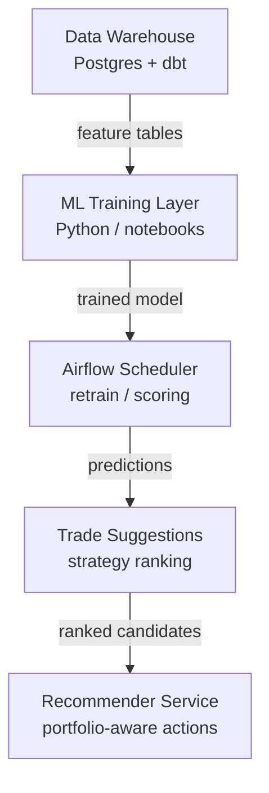
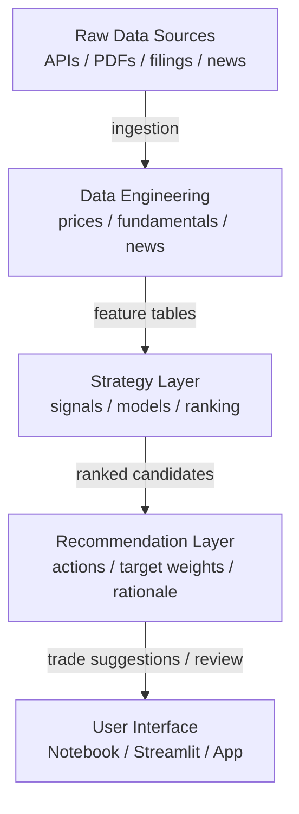

# Trading Platform (Agreed Architecture Scaffold)

This repository now matches the agreed ML-first architecture for a personal trading platform.

## Directory layout

```text
trading-platform/
├── data_pipeline/
│   ├── ingest_prices.py
│   ├── ingest_fundamentals.py
│   └── ingest_company_data.py
├── dbt/
│   ├── dbt_project.yml
│   ├── profiles.yml
│   └── models/
│       ├── features/
│       │   └── fct_company_snapshot.sql
│       └── staging/
│           ├── sources.yml
│           ├── stg_balance_sheet.sql
│           ├── stg_company_info.sql
│           ├── stg_institutional_holders.sql
│           └── stg_major_holders.sql
├── src/
│   ├── agents/
│   │   ├── base.py
│   │   ├── market_analysis.py
│   │   ├── registry.py
│   │   └── run_agent.py
│   ├── features/
│   │   └── build_features.py
│   ├── recommender/
│   │   └── generate_recommendations.py
│   ├── training/
│   │   └── train_return_model.py
│   ├── scoring/
│   │   └── score_universe.py
│   └── strategies/
│       └── generate_trade_candidates.py
├── notebooks/
│   ├── research_modeling.ipynb
│   └── factor_analysis.ipynb
├── airflow/
│   └── dags/
│       └── trading_pipeline_dag.py
├── models/
│   └── trained_models/
└── dashboard/
    └── streamlit_app.py
```

## Recommended ML architecture



## Overall architecture



## Recommender service

The platform now includes a batch recommender stage after scoring and trade candidate generation.
It is designed as a decision-support layer rather than a collaborative-filtering recommender.

## Base agent structure

The repo now includes a small agent scaffold in `src/agents/` so higher-level decision logic has a stable shape:

- `base.py`
  - shared `AgentContext` and `AgentResult` dataclasses
  - `BaseAgent` protocol for future agents
- `market_analysis.py`
  - default portfolio-review agent built on score, candidate, and holdings inputs
- `registry.py`
  - central place to register default agents
- `run_agent.py`
  - simple CLI runner for local CSV artifacts

Run it with:

```bash
make run-agent
```

Current service contract:

- inputs: latest score artifact, latest candidate artifact, optional latest portfolio holdings from Postgres
- output artifact: `models/trained_models/latest_recommendations.csv`
- output fields:
  - `symbol`
  - `action`
  - `recommendation_score`
  - `target_weight`
  - `expected_return`
  - `risk_score`
  - `confidence`
  - `rank`
  - `company`
  - `portfolio_name`
  - `generated_at`
  - `rationale`

Default action set:
- `BUY`
- `ADD`
- `WATCH`
- `HOLD`
- `TRIM`
- `EXIT`

The recommender uses model outputs plus simple portfolio-aware rules:
- promote strong unheld names to `BUY`
- promote strong held names to `ADD`
- keep mid-conviction held names as `HOLD`
- degrade weak high-weight positions to `TRIM` or `EXIT`

## Historical analysis and backtesting

The platform now includes a first-pass historical workflow for current holdings and recommender rules.

- `src/backtesting/load_price_history.py`
  - loads daily price history for holdings and benchmarks
  - writes `models/trained_models/historical_prices.csv`
- `src/analytics/evaluate_holdings_history.py`
  - computes trailing `3M` and `6M` returns, volatility, drawdown, and benchmark-relative returns
  - writes `models/trained_models/holding_performance_report.csv`
- `src/backtesting/backtest_recommender.py`
  - runs a simple walk-forward backtest over the current rule-based recommender
  - writes `models/trained_models/recommender_backtest_history.csv`
  - writes `models/trained_models/recommender_backtest_summary.csv`

## Quick start (virtual environment + Makefile)

```bash
make setup
make run-pipeline
make run-dashboard
```

If you prefer manual activation:

```bash
source .venv/bin/activate
```

Useful commands:

```bash
make help
make run-prices-apple
make run-ingestion
make run-company
make run-features
make run-training
make run-scoring
make run-strategy
make run-recommender
make run-history
make run-holdings-report
make run-backtest
make dbt-run
make test-aapl-pipeline
make test-recommender
make test-analytics
make init-portfolios
PORTFOLIO_NAME="My ISA" PORTFOLIO_HOLDER="Ruaan Venter" PORTFOLIO_TYPE=ISA make add-portfolio
```

## Initial big-tech test pipeline (yfinance -> Postgres -> dbt)

1. Start a Postgres database and create a database named `trading_platform`.
2. Configure environment variables (or copy from `.env.example`).
3. Run:

```bash
make setup
set -a && source .env && set +a
make test-aapl-pipeline
```

This will:
- Ingest Apple (`AAPL`), Alphabet (`GOOG`), and Microsoft (`MSFT`) datasets from `yfinance` into `raw.*` company tables.
- Run dbt models to shape data into `analytics_staging.*` and `analytics_features.*`.

## Personal portfolios

The project can also store your own portfolios in Postgres under `app.personal_portfolios`.
Portfolio metadata is stored in `app.personal_portfolios`.
Each refresh run creates a row in `app.portfolio_snapshots`.
Each instrument captured for that run is stored in `app.portfolio_holdings`.

Fields:
- `name`
- `holder`
- `portfolio_type` (for example `SIPP`, `ISA`, or `Stocks`)

Supported holding fields from a copied CSV export:
- `company`
- `instrument_name`
- `ticker`
- `quantity`
- `quantity_label`
- `price`
- `market_value`
- `total_cost`
- `gain_loss_value`
- `gain_loss_pct`
- `currency`
- `sector`
- `as_of_date`

Supported snapshot metadata:
- `snapshot_at`
- `source_updated_at`
- `quote_delay_note`
- `source_name`
- `fx_note`

Create the table and add a record:

```bash
make init-portfolios
PORTFOLIO_NAME="My ISA" PORTFOLIO_HOLDER="Ruaan Venter" PORTFOLIO_TYPE=ISA make add-portfolio
```

Import holdings from a CSV export:

```bash
PORTFOLIO_NAME="My ISA" \
PORTFOLIO_HOLDER="Ruaan Venter" \
PORTFOLIO_TYPE=ISA \
PORTFOLIO_CSV_PATH=/absolute/path/to/portfolio.csv \
PORTFOLIO_SNAPSHOT_AT=2026-03-08T15:32:00 \
PORTFOLIO_SOURCE_UPDATED_AT=2026-03-08T15:31:00 \
PORTFOLIO_QUOTE_DELAY_NOTE="Delayed by at least 15 minutes" \
PORTFOLIO_SOURCE_NAME="Interactive Investor" \
PORTFOLIO_FX_NOTE="USD values converted to GBP at indicative FX rate" \
make add-portfolio
```

The importer will try to map common column names such as `company`/`name`, `ticker`/`symbol`, `shares` or `units` into `quantity`, `value`/`market_value`, `total_cost`, and gain/loss columns.

Repeated runs append new snapshots instead of replacing prior holdings, so you can track how the portfolio changes during the day.
The Streamlit dashboard will show the latest portfolio view and the stored snapshot history when the database is reachable.

## Price providers (yfinance + Massive API)

`data_pipeline/ingest_prices.py` supports two methods:
- `yfinance`
- `massive` (Massive/Polygon Stocks API)

Use environment variables:

```bash
export PRICE_SYMBOL=AAPL
export YF_SYMBOLS=AAPL,GOOG,MSFT
export PRICE_PROVIDER=both   # yfinance | massive | both
export MASSIVE_API_KEY=your_key_here
export MASSIVE_BASE_URL=https://api.polygon.io
```

Run Apple test:

```bash
make run-prices-apple
```
